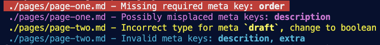

# Eleventy Plugin: Collection Schemas

> Enforce a typed frontmatter schema for templates within an Eleventy collection.

Define a unique schema per collection, then receive output during development and builds to note incorrectly typed, missing, invalid, or misplaced custom data keys.



<small>_Terminal output example shown in VS Code using the theme [Apollo Midnight](https://marketplace.visualstudio.com/items?itemName=apollographql.apollo-midnight-color-theme)_</small>

**Conditions evaluted for**:

- Missing required meta keys: [LIST]
- Possibly misplaced meta keys: [LIST]
- Incorrect type for meta [KEY], change to [TYPE]
- Invalid meta keys: [LIST]

`Invalid` catches typos or extra, untyped keys that may need to be added to the schema.

## Installation and Usage

Install the plugin:

```bash
npm install @11tyrocks/eleventy-plugin-collection-schemas
```

Then, include it in your `.eleventy.js` config file:

```js
const collectionSchemas = require("../eleventy-plugin-collection-schemas");

module.exports = (eleventyConfig) => {
  eleventyConfig.addPlugin(collectionSchemas);
};
```

You'll also need to create or add to a global `eleventyComputed.js` file which should live in your [global data directory](https://www.11ty.dev/docs/config/#directory-for-global-data-files) (default: `_data`). This is to enable access of the total computed page data to the plugin.

```js
module.exports = {
  metaSchema: function (data) {
    return this.metaSchema(data);
  },
};
```

The plugin works by adding a [custom data extension](https://www.11ty.dev/docs/data-custom/) (plugin default: `.meta`). This `.meta` file works similar to a directory data file, so it will need the same name as the parent directory of your collection. To associate the schema with the collection, the collection will also need the same name.

For each collection you want to enforce a schema for, you'll need to have the following setup, which assumes a collection named `pages`:

```text
pages/
  pages.meta
  pages.json
  page-one.md <- content in any templating language
```

Where `pages.json` is a [directory data file](https://www.11ty.dev/docs/data-template-dir/) that creates the collection via the tags mechanism:

```json
{
  "tags": "pages"
}
```

> ✨ **Tip**: You can also use the directory data file to [change the permalink](https://11ty.rocks/tips/permalinks/) for all templates in a collection if you don't want them to have the collection name as URL base.

### Schema Format

The content of the `.meta` file is JSON formatted, with the parent key being the name of your custom data key, and the child properties of `type` and `required`.

```json
{
  "title": {
    "type": "string",
    "required": true
  },
  "draft": {
    "type": "boolean",
    "required": false
  },
  "categories": {
    "type": "array",
    "required": false
  },
  "order": {
    "type": "number",
    "required": true
  }
}
```

> **Note**
>
> Data that Eleventy expects such as `date` should not be included in your schema, only custom data.

### Use in templates

To adhere to your schema within templates, the default is to nest the schema-defined properties under a `meta` key ([configurable](#config-options)).

```md
---
meta:
  title: "My Page Title"
  order: 3
  description: "One morning, when Gregor Samsa woke from troubled dreams, he found himself transformed in his bed into a horrible vermin."
---
```

## Config Options

| Option        | Type   | Default | Description                         |
| ------------- | ------ | ------- | ----------------------------------- |
| metaKey       | string | 'meta'  | Key to define data within templates |
| metaExtension | string | 'meta'  | File extension to use for schemas   |

## Schema Limitations

- Only one level of schema data is currently possible
- Only the top-level collection is used to locate schemas
